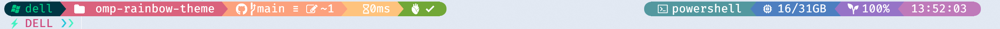

# 🌈 Oh My Posh Rainbow Theme

[Oh My Posh](https://ohmyposh.dev/) rainbow theme inspired by [cloud-native-azure](https://github.com/JanDeDobbeleer/oh-my-posh/blob/main/themes/cloud-native-azure.omp.json), [montys](https://github.com/JanDeDobbeleer/oh-my-posh/blob/main/themes/montys.omp.json), and [clean-detailed](https://github.com/JanDeDobbeleer/oh-my-posh/blob/main/themes/clean-detailed.omp.json). 

## Preview

## Install

Install and use [Nerd Fonts](https://www.nerdfonts.com/) in terminal. Copy [`rainbow.omp.json`](./rainbow.omp.json) to Oh My Posh theme folder and [change theme]([Customize | Oh My Posh](https://ohmyposh.dev/docs/installation/customize)). 